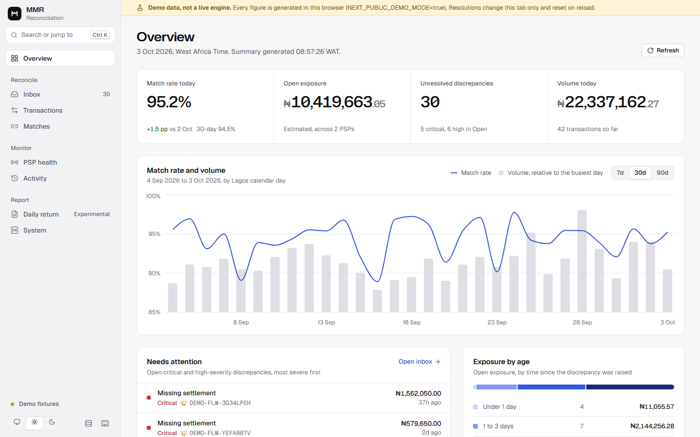

# MMR — Money Movement Reconciliation Engine

[](https://github.com/emmanuelrichard01/mmr-engine/actions/workflows/ci.yml)


[](LICENSE)

**PSP-to-ledger reconciliation reference implementation for Nigerian payments.**

**In plain terms:** a business that takes payments through Paystack and Flutterwave gets a separate
record of every payment from each one, and the records don't always agree. Settlements go missing,
amounts differ, and the same event can arrive twice. Someone in finance then finds the gaps by hand in
a spreadsheet. MMR does that work automatically: it collects every event, stores it once, pairs the
records that describe the same money, and puts whatever doesn't add up into a review inbox, with the
evidence attached.

> **Project status: complete (v1.0.0).** MMR is maintained as a reference implementation. It gets no
> further feature work, only correctness, security or documentation fixes. It was built and tested on
> synthetic data and has never been deployed with live merchant data. See
> [Honest scope & limitations](#honest-scope--limitations).

Under the hood it's a study in the unglamorous parts of payments engineering that decide whether the
numbers can be trusted: idempotency, offset management, exact money arithmetic, one-to-one matching
enforced by the database, append-only audit trails and least-privilege data access.



<sub>The operations console on 14 days of synthetic data. More screenshots (light and dark, desktop
and mobile) are in [dashboard/docs/screenshots](dashboard/docs/screenshots/).</sub>

| Read next | For |
|---|---|
| [docs/ARCHITECTURE.md](docs/ARCHITECTURE.md) | Processes, data layers, every guarantee with the test that proves it, failure modes, security model |
| [docs/OPERATIONS.md](docs/OPERATIONS.md) | Running, observing and troubleshooting the stack; dashboard pages |
| [docs/adr/0001-pii-tokenization.md](docs/adr/0001-pii-tokenization.md) | Why names are matched on keyed tokens, not masked strings |
| [dashboard/DESIGN.md](dashboard/DESIGN.md) | The console's design system |
| [CHANGELOG.md](CHANGELOG.md) | What v1.0.0 fixed and why |

---

## What it does

```
 Paystack / Flutterwave                        PSP REST APIs
 webhooks (signed)                             (gap detection, backfill)
        │                                              │
        ▼                                              ▼
 ┌──────────────────────────────────────────────────────────┐
 │ FastAPI  verify signature → register idempotency key +   │
 │          publish to Redpanda in ONE unit (ack or rollback)│
 └───────────────────────────┬──────────────────────────────┘
                             ▼
 Redpanda ── consumer_worker (per-message offset commits, DLQ)
                             │
          ┌──────────────────┴──────────────────┐
          ▼                                     ▼
  Bronze: MinIO Parquet                 Silver: PostgreSQL
  every raw event, immutable            canonical transactions (NUMERIC money,
                                        masked display fields, keyed name tokens)
                                                │
                     scheduler (every 5 min)    ▼
          ┌─────────────────────────────────────────────────┐
          │ Gold: matched pairs (one-to-one, DB-enforced),   │
          │ discrepancies + append-only event history,       │
          │ summary view, daily return (experimental)        │
          └───────────┬───────────────────────┬─────────────┘
                      ▼                       ▼
        Next.js dashboard (via server-side    Prometheus / Grafana,
        proxy; API key never in the browser)  Slack alerts
```

| Stage | What happens | Where |
|---|---|---|
| Ingest | HMAC-SHA512 (Paystack) / secret-hash (Flutterwave) check on the raw body; idempotency key registered in the same transaction that waits for the broker ack. A failed publish rolls back, so the PSP's retry is processed normally. | `src/api/v1/routes/webhooks.py`, `src/flows/ingestion_flow.py` |
| Bronze | Every message is written to MinIO as Parquet, including event types the engine doesn't model. | `src/flows/transform_flow.py` |
| Silver | Only modelled events (`charge.success`, `transfer.*`, successful Flutterwave charges, …) become canonical rows. Unknown events are never guessed into credits. Amounts are `NUMERIC(20,6)`; kobo conversion is exact. | `src/engine/normaliser.py` |
| Match | Tier 1: same amount, complementary type, different PSP, closest in time. Tier 2: weighted evidence (amount, time, counterparty-name tokens, bank). Ties are left unmatched for review instead of guessed. | `src/engine/matching.py`, `src/flows/matching_flow.py` |
| Discrepancies | Missing settlement (severity escalates with age), amount mismatch, FX variance (only when the rate move actually explains the gap). Each state change is written to an append-only event table. | `src/engine/discrepancy.py`, migration `015` |
| Recover | Gap detection polls each PSP every 6 h and re-ingests anything a webhook missed; idempotency makes already-seen events free. | `src/flows/gap_detection_flow.py` |

## Engineering decisions worth reading

- **Effectively-once, not "exactly-once".** At-least-once delivery from Redpanda + idempotency keys +
  a `UNIQUE` constraint on Silver = each event lands once. The idempotency key commits only after the
  broker acknowledges the publish; consumer offsets are committed per message, only after the message
  is processed or durably dead-lettered. A dead-letter publish failure stalls the partition rather
  than skipping the event.
- **One transaction, one match, enforced by Postgres.** `gold_matched_transactions` has its primary
  key on `transaction_id`. Two matching runs racing for the same transaction cannot both win; the loser's
  savepoint rolls back. Covered by a concurrency test against real Postgres.
- **Masking is for display; tokens are for matching.** Masked names (`C***** O******`) collide for
  different people, so matching on them is wrong. Names are stored as keyed HMAC tokens per word
  (order- and honorific-insensitive). See [ADR 0001](docs/adr/0001-pii-tokenization.md).
- **Ambiguity is a result, not an error.** When two candidates are equally good, the engine leaves
  the transaction unmatched with the evidence attached. A wrong automatic match costs more than a
  manual review.
- **Least privilege that actually holds.** Migrations run as the owner; the API role can update only
  resolution columns; nobody (including the owner) can `UPDATE`/`DELETE` audit rows, because a trigger
  blocks it. All three are tested.
- **Fail-closed configuration.** `ENVIRONMENT` defaults to `production`. Empty secrets are rejected at
  boot. API auth can be disabled only in development.

Each of these guarantees is listed next to the test that proves it in
[ARCHITECTURE.md → Guarantees](docs/ARCHITECTURE.md#guarantees-and-where-they-are-enforced).

## Running it

Requirements: Docker, Python 3.12 (with [uv](https://docs.astral.sh/uv/) recommended), Node 22.

```bash
cp .env.example .env            # fill in every "replace-me"
make up                         # stack + automatic migrations
make demo-full                  # 14 days of synthetic data → replay → match → verify
make api-key NAME=dashboard SCOPE=write   # then put the key in DASHBOARD_API_KEY
```

| Service | URL |
|---|---|
| Dashboard | http://localhost:3000 |
| API docs (non-production only) | http://localhost:8000/docs |
| Prefect UI (flow-run history) | http://localhost:4200 |
| Redpanda console | http://localhost:8080 |
| Grafana / Prometheus (`make up-monitoring`) | http://localhost:3001 / :9090 |

All ports bind to `127.0.0.1`. See [docs/OPERATIONS.md](docs/OPERATIONS.md) for day-to-day operations.

### Development

```bash
uv venv && uv pip install -e ".[test,dev]"
make check        # ruff + format check + mypy --strict + security scan + tests
make test-db      # database tests only (real PostgreSQL)
```

Database tests use `MMR_TEST_DATABASE_URL` when set (CI uses a `postgres:16` service) and otherwise
start an embedded PostgreSQL via `pgserver`, so they run locally without Docker.

## By the numbers (verified against this repository)

| | |
|---|---|
| Tests | 276, including 23 against real PostgreSQL (migrations round-trip, concurrency, triggers, grants) and property-based tests of the matching invariants |
| Static checks | ruff (lint + format), `mypy --strict` with zero errors on `src/` |
| Migrations | 16 (`000`–`015`), all reversible |
| Tables | 15 + 1 materialized view |
| HTTP endpoints | 19 documented: 2 webhooks, 13 reconciliation (incl. transaction explorer, pair inspector, bulk resolve), 2 reports, search, pipeline runs (+ `/health`, `/health/ready`, `/metrics`) |
| PSP connectors | 2 (Paystack, Flutterwave) |

## Honest scope & limitations

- **No bank-statement leg.** MMR reconciles PSP records against PSP records. It does not prove that
  cash reached a bank account; that needs bank statements or bank alerts, which are out of scope here.
- **Synthetic data only.** Every number shown in the demo is generated. The engine has not processed
  live merchant traffic.
- **Single tenant.** One set of PSP credentials, no tenant isolation.
- **Batch settlements are not solved.** Matching is one-to-one. Many-to-one settlement batches without
  settlement IDs (a subset-sum problem) are not handled.
- **Matching semantics are a model.** Pairing a credit on one PSP with a debit on another fits flows like
  "collect on Paystack, pay out on Flutterwave". Other business flows need other pairing rules.
- **Business-day calendar** skips weekends in WAT but does not model Nigerian public holidays.
- **Daily return (CBN-style) is experimental.** It is a reporting prototype, not a compliance product,
  and it does not follow an official CBN template. Merchants do not file CBN returns.
- **Latency.** Ingestion is near-real-time, but that is an internal pipeline metric; PSP settlement
  itself is typically T+1, so reconciliation outcomes are only as fresh as settlement.
- **Rate limiting is per process** (in-memory buckets); a shared store would be needed for a global limit.
- **pgaudit is not enabled** (it needs a custom Postgres image). The application-level audit trail is the
  append-only `gold_discrepancy_events` table.
- **Privacy.** Designed with the Nigeria Data Protection Act 2023 in mind (masking, tokenization, data
  minimisation); this is an engineering control, not a compliance certification.

## Repository map

```
src/
  api/          FastAPI app, auth + rate-limit middleware, routes
  connectors/   Paystack / Flutterwave signature checks and REST polling clients
  engine/       pure logic: normaliser, matching, discrepancy, FX, PII, settlement windows
  flows/        consumer worker, scheduler, matching / gap detection / backfill / daily return
  storage/      Postgres sessions, Kafka producer/consumer, MinIO, pipeline-run bookkeeping
alembic/        migrations 000–015
dashboard/      Next.js operations console (server-side API proxy)
infra/          Prometheus rules, Grafana dashboard, Redpanda console
tests/          unit, contract, and real-Postgres integration tests
docs/           ARCHITECTURE, OPERATIONS, ADRs; docs/archive = pre-build design specs
```

## What I'd do next

The honest gap in MMR is the first limitation above: PSP-to-PSP agreement is not proof of money
received. The direction that closes it, and that I'm pursuing as a separate product, starts from
verified ground truth instead:

1. **Bank leg first.** DKIM-verified bank alert emails and HMAC-verified PSP virtual-account webhooks
   as the source of truth for "money arrived", rather than PSP-reported state.
2. **Narrow wedge, real users.** Answer one question for businesses where the person confirming payment
   isn't the account owner, such as cashiers, riders and front desks: *did this transfer actually land?*
   Multi-tenant from day one (Postgres RLS), integer-kobo money, hash-chained audit log.
3. **Then widen back toward MMR.** A batch-settlement solver, accounting sync and tax evidence, if the
   wedge proves demand.

## Contributing and security

MMR is complete, so it doesn't take feature pull requests. Bug reports are welcome as issues,
especially anything that makes a claim in this README or in ARCHITECTURE.md untrue. To report a
vulnerability privately, see [SECURITY.md](SECURITY.md).

## License

[MIT](LICENSE) © 2026 Emmanuel Richard
