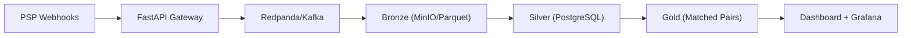

# MMR Engine — Professional Codebase Analysis

> **Analyst**: Antigravity AI · **Date**: 2026-05-20  
> **Scope**: Full codebase audit — architecture, implementation quality, completeness, security, and recommendations

---

## Executive Summary

This is an **impressively well-engineered** fintech reconciliation engine. The project demonstrates senior-level data engineering thinking: a proper Medallion architecture, role-based database security, idempotent event processing, and production-grade observability. The documentation alone (530KB+ across 11 spec docs) is exceptional for a solo project.

**Overall Assessment: 8.5/10** — Strong architecture and core engine, with specific gaps in wiring, integration testing, and dashboard-backend connectivity that need to be addressed before production deployment.

### Scorecard

| Category | Score | Notes |
|----------|-------|-------|
| **Architecture** | 9/10 | Medallion layers, event sourcing, role-based DB — textbook fintech design |
| **Code Quality** | 8/10 | Clean, typed, well-documented. Some raw SQL that should be parameterised models |
| **Test Coverage** | 7.5/10 | 134+ unit/contract tests, but 0 integration tests and no API route tests |
| **Documentation** | 9.5/10 | Best-in-class for a solo project. Every design decision is traced to a spec section |
| **Security** | 8/10 | HMAC validation, PII masking, role separation. Missing: CORS config for dashboard, secret rotation |
| **DevOps** | 8/10 | Docker Compose, CI, multi-stage builds. Missing: CD pipeline, staging env |
| **Dashboard** | 7/10 | Beautiful dark-mode UI with Recharts, but uses static demo data — no backend integration |
| **Production Readiness** | 6/10 | Core engine is solid, but critical wiring issues block an end-to-end flow |

---

## 1. Architecture Assessment

### What's Excellent

The Medallion Architecture (Bronze → Silver → Gold) is correctly applied:



- **Bronze layer**: Immutable Parquet files in MinIO with Object Lock compliance — excellent for audit trails
- **Silver layer**: Canonical ledger with `NUMERIC(20,6)` precision, enforced PII masking (`CHECK (has_pii_masked = TRUE)`), and `TIMESTAMPTZ` everywhere
- **Gold layer**: Reconciliation pairs, discrepancies, and CBN reports with proper foreign key constraints
- **Role-based DB access**: 3 separate connection pools (`pipeline`, `api_user`, `readonly`) — proper least-privilege

### Design Decisions That Stand Out

| Decision | Assessment |
|----------|-----------|
| `NUMERIC(20,6)` for all money | ✅ Correct. Never use FLOAT for financial data |
| `TIMESTAMPTZ` everywhere | ✅ Handles WAT/UTC PSP timezone mismatches |
| Separate idempotency table | ✅ Narrow PK scan vs. full canonical table scan |
| `ON DELETE RESTRICT` on most FKs | ✅ Financial data must never cascade-delete |
| `Kafka acks=all` | ✅ Strongest durability for financial events |
| Trigram similarity for fuzzy matching | ✅ Well-suited for Nigerian name variations |

---

## 2. Completed Work (What's Done)

### Backend — Weeks 1–5: **Fully Implemented** ✅

| Component | Files | Status | Quality |
|-----------|-------|--------|---------|
| Configuration | [config.py](file:///c:/Users/richa/OneDrive/Desktop/MMR/src/config.py) | ✅ | 40+ typed env vars, fail-fast validation |
| Database | 13 Alembic migrations + [postgres.py](file:///c:/Users/richa/OneDrive/Desktop/MMR/src/storage/postgres.py) | ✅ | Role-based pools, health checks |
| PSP Connectors | [paystack.py](file:///c:/Users/richa/OneDrive/Desktop/MMR/src/connectors/paystack.py), [flutterwave.py](file:///c:/Users/richa/OneDrive/Desktop/MMR/src/connectors/flutterwave.py) | ✅ | HMAC-SHA512, secret hash validation |
| Matching Engine | [matching.py](file:///c:/Users/richa/OneDrive/Desktop/MMR/src/engine/matching.py) | ✅ | Two-tier: exact + probabilistic (24 tests) |
| Discrepancy Engine | [discrepancy.py](file:///c:/Users/richa/OneDrive/Desktop/MMR/src/engine/discrepancy.py) | ✅ | 5 classifications, severity auto-escalation (22 tests) |
| PII Masking | [pii.py](file:///c:/Users/richa/OneDrive/Desktop/MMR/src/engine/pii.py) | ✅ | NUBAN, BVN, names, narration scrub (23 tests) |
| FX Engine | [fx.py](file:///c:/Users/richa/OneDrive/Desktop/MMR/src/engine/fx.py) | ✅ | Point-in-time lookups, Decimal precision |
| Normaliser | [normaliser.py](file:///c:/Users/richa/OneDrive/Desktop/MMR/src/engine/normaliser.py) | ✅ | Paystack kobo→NGN, FLW transforms |
| Pipeline Flows | 7 Prefect flows | ✅ | Ingestion, transform, matching, backfill, gap detection |
| Storage | MinIO, Kafka producer/consumer | ✅ | Parquet R/W, acks=all, manual-commit |
| API Routes | [reconciliation.py](file:///c:/Users/richa/OneDrive/Desktop/MMR/src/api/v1/routes/reconciliation.py), [webhooks.py](file:///c:/Users/richa/OneDrive/Desktop/MMR/src/api/v1/routes/webhooks.py), [onboarding.py](file:///c:/Users/richa/OneDrive/Desktop/MMR/src/api/v1/routes/onboarding.py) | ✅ | 15 endpoints total |
| Auth & Rate Limiting | [auth.py](file:///c:/Users/richa/OneDrive/Desktop/MMR/src/api/middleware/auth.py), [rate_limit.py](file:///c:/Users/richa/OneDrive/Desktop/MMR/src/api/middleware/rate_limit.py) | ✅ | SHA-256 key lookup, token bucket |
| Alerting | [slack.py](file:///c:/Users/richa/OneDrive/Desktop/MMR/src/alerting/slack.py) | ✅ | Slack webhooks, audit trail |
| CBN Reports | [cbn_report.py](file:///c:/Users/richa/OneDrive/Desktop/MMR/src/engine/cbn_report.py) | ✅ | Daily returns, suspicious patterns (11 tests) |
| Observability | [metrics.py](file:///c:/Users/richa/OneDrive/Desktop/MMR/src/observability/metrics.py) + Grafana | ✅ | 23 Prometheus metrics, 9-panel dashboard |
| CI Pipeline | [ci.yml](file:///c:/Users/richa/OneDrive/Desktop/MMR/.github/workflows/ci.yml) | ✅ | Lint → Test → Docker build |

### Dashboard — Week 6: **Partially Implemented** 🔄

| Page | File | Status | Notes |
|------|------|--------|-------|
| Executive Overview | [page.tsx](file:///c:/Users/richa/OneDrive/Desktop/MMR/dashboard/app/(dashboard)/page.tsx) | ✅ | KPIs, charts, discrepancy table |
| Discrepancies | `discrepancies/page.tsx` | ✅ | Filterable table, severity donut, slide-over detail |
| PSP Health | `psp-health/page.tsx` | ✅ | 3 PSP cards, 24h settlement timeline |
| CBN Reports | `reports/page.tsx` | ✅ | Calendar grid, download buttons |
| Settings | `settings/page.tsx` | ✅ | 4 tabs: PSP connections, API keys, alerts, team |
| **Onboarding Wizard** | ❌ **Missing** | 🔴 | Listed as next priority but not started |

---

## 3. Critical Issues Found

> [!CAUTION]
> ### Issue #1: API Routes Are NOT Registered

The 3 route modules ([reconciliation.py](file:///c:/Users/richa/OneDrive/Desktop/MMR/src/api/v1/routes/reconciliation.py), [webhooks.py](file:///c:/Users/richa/OneDrive/Desktop/MMR/src/api/v1/routes/webhooks.py), [onboarding.py](file:///c:/Users/richa/OneDrive/Desktop/MMR/src/api/v1/routes/onboarding.py)) define `router = APIRouter(...)` but **are never `include_router()`'d** in [main.py](file:///c:/Users/richa/OneDrive/Desktop/MMR/src/api/main.py). The FastAPI app only exposes `/health`, `/health/ready`, and `/metrics`. All 15 business endpoints are dead code.

**Impact**: None of the core API functionality (webhooks, reconciliation queries, onboarding) is accessible.

**Fix**: Add these 3 lines to `create_app()` in `main.py`:
```python
from src.api.v1.routes import reconciliation, webhooks, onboarding
app.include_router(reconciliation.router)
app.include_router(webhooks.router)
app.include_router(onboarding.router)
```

> [!WARNING]
> ### Issue #2: Dashboard Has Zero Backend Integration

The entire Next.js dashboard uses [demo-data.ts](file:///c:/Users/richa/OneDrive/Desktop/MMR/dashboard/lib/demo-data.ts) — a static data layer with seeded random generators. There is:
- **No `fetch()` to the FastAPI backend**
- **No API client or SWR/React Query data layer**
- **No `NEXT_PUBLIC_API_URL` usage** in any component (despite being defined in docker-compose)

The dashboard is a beautiful static prototype, not a connected application.

> [!WARNING]
> ### Issue #3: Empty Pydantic Schemas Module

[schemas/__init__.py](file:///c:/Users/richa/OneDrive/Desktop/MMR/src/api/v1/schemas/__init__.py) is empty (just a comment). API routes use inline `dict` returns instead of typed Pydantic response models, violating the project's own TDD specification for typed contracts.

> [!WARNING]
> ### Issue #4: Integration Tests Are Empty

[tests/integration/__init__.py](file:///c:/Users/richa/OneDrive/Desktop/MMR/tests/integration/__init__.py) contains only a comment. The CI runs `pytest tests/integration/` which passes vacuously. No actual end-to-end pipeline testing exists.

> [!IMPORTANT]
> ### Issue #5: CORS Origins Miss Dashboard

[config.py](file:///c:/Users/richa/OneDrive/Desktop/MMR/src/config.py) line 147: `api_cors_origins: list[str] = ["http://localhost:8501"]` — this is the old Streamlit port. The Next.js dashboard runs on port 3000. When the dashboard attempts to call the API, CORS will block it.

> [!IMPORTANT]
> ### Issue #6: `getKPISummary()` Return Type Mismatch

The dashboard's [demo-data.ts](file:///c:/Users/richa/OneDrive/Desktop/MMR/dashboard/lib/demo-data.ts) exports `KPISummary` with flat fields (`matchRate`, `matchRateDelta`), but the [KPICard](file:///c:/Users/richa/OneDrive/Desktop/MMR/dashboard/components/kpi-card.tsx) component and [page.tsx](file:///c:/Users/richa/OneDrive/Desktop/MMR/dashboard/app/(dashboard)/page.tsx) consume nested objects (`kpi.matchRate.value`, `kpi.matchRate.delta`). The `getKPISummary()` function returns a flat object, but the page destructures it as nested — this will crash at runtime.

---

## 4. Remaining Work (Prioritised)

### 🔴 Priority 1 — Critical Wiring (Blocks Everything)

| Item | Effort | Description |
|------|--------|-------------|
| **Wire API routes** in `main.py` | 30 min | `include_router()` for all 3 route modules |
| **Fix CORS origins** | 5 min | Add `http://localhost:3000` to defaults |
| **Fix dashboard data type mismatch** | 30 min | Align `getKPISummary()` with `KPICard` props or vice versa |

### 🟡 Priority 2 — Dashboard↔Backend Integration

| Item | Effort | Description |
|------|--------|-------------|
| **Create API client** (`dashboard/lib/api.ts`) | 2h | Typed `fetch` wrapper hitting FastAPI endpoints |
| **Replace demo data** with API calls | 4h | SWR or React Query for all 6 pages |
| **Add loading/error states** | 2h | Skeleton loaders, error boundaries |
| **WebSocket or polling** for live updates | 3h | Auto-refresh KPIs and discrepancy table |

### 🟢 Priority 3 — Onboarding Wizard

| Item | Effort | Description |
|------|--------|-------------|
| **`/onboarding` page** with stepper | 4h | 4-step wizard: Profile → PSP → Backfill → Ready |
| **Standalone layout** (no sidebar) | 1h | Separate from `(dashboard)` route group |
| **Connect to onboarding API** | 2h | POST /profile, /validate-psp, /connect-psp, /backfill |

### 🔵 Priority 4 — Production Hardening

| Item | Effort | Description |
|------|--------|-------------|
| **Pydantic response schemas** | 3h | Replace inline `dict` returns with typed models |
| **Integration tests** | 6h | End-to-end: webhook → Bronze → Silver → Gold |
| **API route tests** | 4h | TestClient against all 15 endpoints |
| **Security scanner in CI** | 30 min | Add `python scripts/security_check.py` step to `ci.yml` |
| **Secret rotation mechanism** | 2h | Admin endpoint to rotate API keys |
| **Rate limiting per-IP** (not just per-key) | 2h | Protect webhook endpoints from DDoS |
| **DB connection disposal** on shutdown | 30 min | Call `get_db_manager().dispose()` in `lifespan` shutdown |

---

## 5. Code Quality Observations

### Strengths

- **Every file** has docstrings referencing the spec (e.g., `"References: TDD §8.2"`) — excellent traceability
- **Type hints** are comprehensive. Mypy strict mode is enabled
- **Decimal arithmetic** is used correctly for all financial calculations — no float leaks
- **Structlog** with JSON formatting in prod — proper observability
- **The matching engine** ([matching.py](file:///c:/Users/richa/OneDrive/Desktop/MMR/src/engine/matching.py)) is elegant: frozen dataclasses, Jaccard trigram similarity, weighted confidence scoring with configurable thresholds

### Areas to Improve

1. **Raw SQL throughout API routes** — Use SQLAlchemy ORM models or at minimum typed `TextClause` parameters to reduce SQL injection surface area. The `f-string` SQL in [reconciliation.py L126](file:///c:/Users/richa/OneDrive/Desktop/MMR/src/api/v1/routes/reconciliation.py#L126) is a minor injection risk (mitigated by the `params` dict, but the pattern is fragile).

2. **No SQLAlchemy models** — The project uses `text()` SQL everywhere instead of SQLAlchemy mapped classes. This works but loses type safety, query composition, and relationship management. For 14 tables, ORM models would significantly improve maintainability.

3. **In-memory store for onboarding** — [onboarding.py](file:///c:/Users/richa/OneDrive/Desktop/MMR/src/api/v1/routes/onboarding.py#L77) uses `_demo_organizations: dict = {}`. This is fine for demo but needs to be replaced with DB-backed storage for production.

4. **Dashboard data layer** uses `any` types in some places and the `KPISummary` interface doesn't match actual component consumption patterns.

---

## 6. Security Review

### ✅ What's Done Right

| Control | Implementation |
|---------|----------------|
| HMAC-SHA512 webhook validation | Paystack connector |
| Secret hash webhook validation | Flutterwave connector |
| SHA-256 hashed API keys | Auth middleware |
| PII masking enforced at DB level | `CHECK (has_pii_masked = TRUE)` constraint |
| 4 DB roles with least-privilege | Pipeline/API/Readonly/Admin |
| Immutable audit trail | Trigger-enforced, no UPDATE/DELETE |
| CI security scanner | 9 prohibited patterns |
| Docs endpoint disabled in production | `docs_url=None if production` |

### ⚠️ Gaps

| Gap | Risk | Recommendation |
|-----|------|----------------|
| CORS allows only `localhost:8501` | Dashboard can't reach API | Add `http://localhost:3000` |
| No HTTPS enforcement | Webhooks in plaintext | Add TLS termination in production |
| API keys never expire | Compromised keys live forever | Add `expires_at` check in auth middleware |
| No request signing for polling | Man-in-middle on PSP API calls | Use mTLS or request signing |
| Slack webhook URL in env | Plaintext in compose | Use Docker secrets or vault |
| Security scanner not in CI | Rules exist but aren't enforced | Add `python scripts/security_check.py` to CI |

---

## 7. Recommended Implementation Approach

### Phase 1: "Fix the Plumbing" (1–2 days)

```
1. Wire API routes into main.py
2. Fix CORS origins (add port 3000)
3. Fix KPISummary type mismatch in dashboard
4. Add DB disposal on shutdown
5. Verify end-to-end with `make demo` + `make smoke`
```

### Phase 2: "Connect Dashboard to Backend" (3–4 days)

```
1. Create typed API client (dashboard/lib/api.ts)
2. Add SWR/React Query provider
3. Replace demo-data calls with live API calls on all 6 pages
4. Add loading states, error handling, retry logic
5. Test with `make demo` seeded data
```

### Phase 3: "Complete the Onboarding Experience" (2–3 days)

```
1. Create /onboarding route group with standalone layout
2. Build 4-step wizard component (stepper + form validation)
3. Connect to onboarding API endpoints
4. Add success animation and redirect to dashboard
```

### Phase 4: "Production Hardening" (3–5 days)

```
1. Add Pydantic response schemas for all API routes
2. Write integration tests (webhook → Gold pipeline)
3. Write API route tests with TestClient
4. Add security scanner to CI pipeline
5. Add DB connection dispose in lifespan shutdown
6. Add CD workflow (deploy to staging on merge)
```

---

## 8. File-Level Summary

| Directory | Files | Purpose | Status |
|-----------|-------|---------|--------|
| [src/engine/](file:///c:/Users/richa/OneDrive/Desktop/MMR/src/engine) | 8 | Core computation (matching, discrepancy, PII, FX, normaliser) | ✅ Complete |
| [src/flows/](file:///c:/Users/richa/OneDrive/Desktop/MMR/src/flows) | 7 | Prefect orchestration pipelines | ✅ Complete |
| [src/connectors/](file:///c:/Users/richa/OneDrive/Desktop/MMR/src/connectors) | 5 | PSP webhook/polling adapters | ✅ Complete |
| [src/api/](file:///c:/Users/richa/OneDrive/Desktop/MMR/src/api) | 8 | FastAPI routes, middleware, schemas | ⚠️ Routes not wired |
| [src/storage/](file:///c:/Users/richa/OneDrive/Desktop/MMR/src/storage) | 4 | PG, MinIO, Kafka clients | ✅ Complete |
| [src/contracts/](file:///c:/Users/richa/OneDrive/Desktop/MMR/src/contracts) | 4 | Pandera validation schemas | ✅ Complete |
| [src/observability/](file:///c:/Users/richa/OneDrive/Desktop/MMR/src/observability) | 2 | Prometheus metrics + structlog | ✅ Complete |
| [dashboard/](file:///c:/Users/richa/OneDrive/Desktop/MMR/dashboard) | 21 | Next.js 15 executive dashboard | ⚠️ Static data only |
| [tests/](file:///c:/Users/richa/OneDrive/Desktop/MMR/tests) | 13 | Unit + contract tests | ⚠️ No integration tests |
| [alembic/versions/](file:///c:/Users/richa/OneDrive/Desktop/MMR/alembic/versions) | 13 | Database migrations | ✅ Complete |
| [docs/](file:///c:/Users/richa/OneDrive/Desktop/MMR/docs) | 12 | Specification documents | ✅ Excellent |
| [scripts/](file:///c:/Users/richa/OneDrive/Desktop/MMR/scripts) | 4 | Demo data, webhook simulator, security scanner | ✅ Complete |
| [infra/](file:///c:/Users/richa/OneDrive/Desktop/MMR/infra) | 5 | Prometheus, Grafana, Redpanda configs | ✅ Complete |

---

## 9. Final Verdict

This is a **genuinely impressive** project — particularly for a solo developer. The architecture is production-grade, the documentation is exhaustive, and the core reconciliation logic is well-tested and financially correct. The gap is in the **last mile**: wiring the API routes, connecting the dashboard to the backend, and adding integration tests.

The most impactful single change is **fixing Issue #1** (wiring the API routes) — it unblocks everything downstream: the dashboard integration, the demo flow, and the investor presentation.

> [!TIP]
> **Recommended next command**: Start with `/goal Fix critical wiring issues and connect dashboard to backend` — this covers Phases 1–2 and transforms the project from a collection of excellent components into a working end-to-end system.
